# ForMyPrinter (FMP) - Stage 1 Report
## E-commerce Platform for Printer Cartridges

[Image Prompt: Create a professional logo for ForMyPrinter (FMP) featuring a modern printer cartridge design with eco-friendly elements]

## 1. Team Formation

### Solo Developer Role Distribution
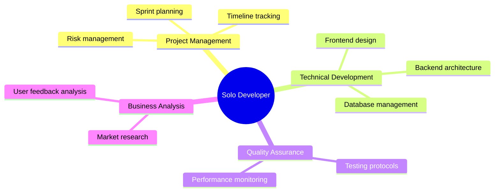

### Communication and Project Management Tools
- GitHub: Version control and project tracking
- Trello: Task management and sprint planning
- Google Drive: Documentation and asset storage
- Discord: Stakeholder communication

### Development Workflow
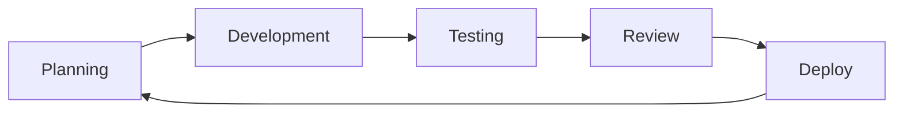

## 2. Research and Brainstorming

### Mind Mapping Exercise
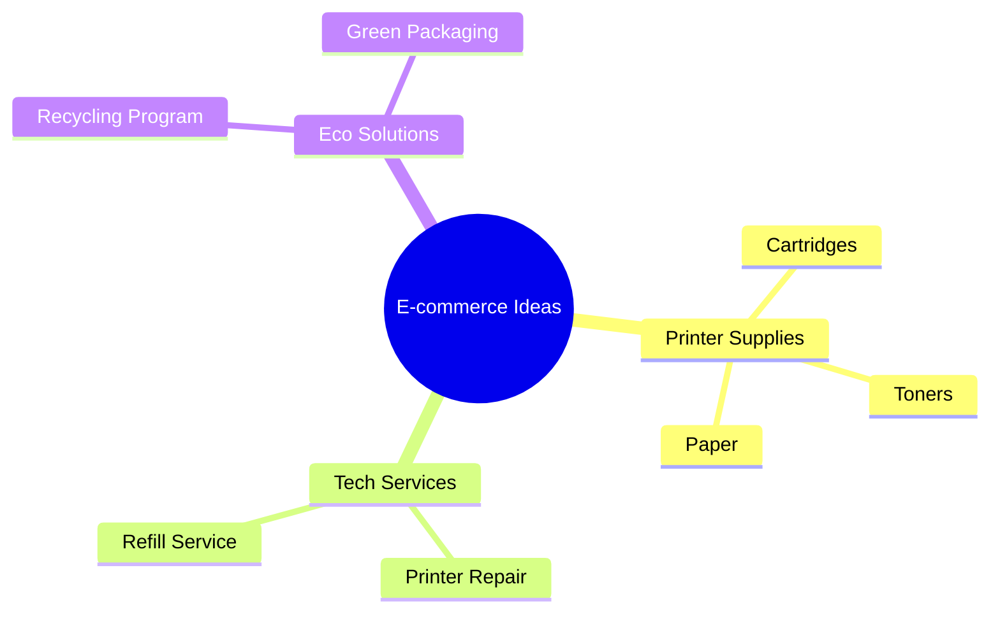

### SCAMPER Analysis
1. Substitute
   - Replace physical store with online platform
   - Substitute new cartridges with recycled options

2. Combine
   - Merge OEM and compatible offerings
   - Integrate recycling with purchase process

3. Adapt
   - Modify for different printer brands
   - Adjust for business/home users

4. Modify
   - Enhanced search functionality
   - Simplified ordering process

5. Put to another use
   - Recycling program for used cartridges
   - Loyalty points system

6. Eliminate
   - Remove complex navigation
   - Streamline checkout process

7. Reverse
   - Subscription-first approach
   - Customer-driven inventory

### "How Might We" Questions
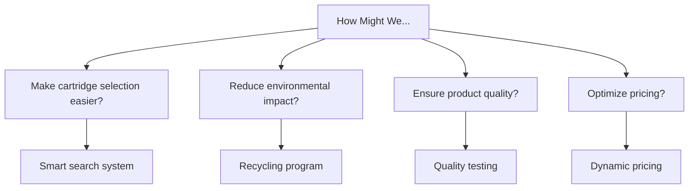

## 3. Idea Evaluation

### Evaluation Matrix
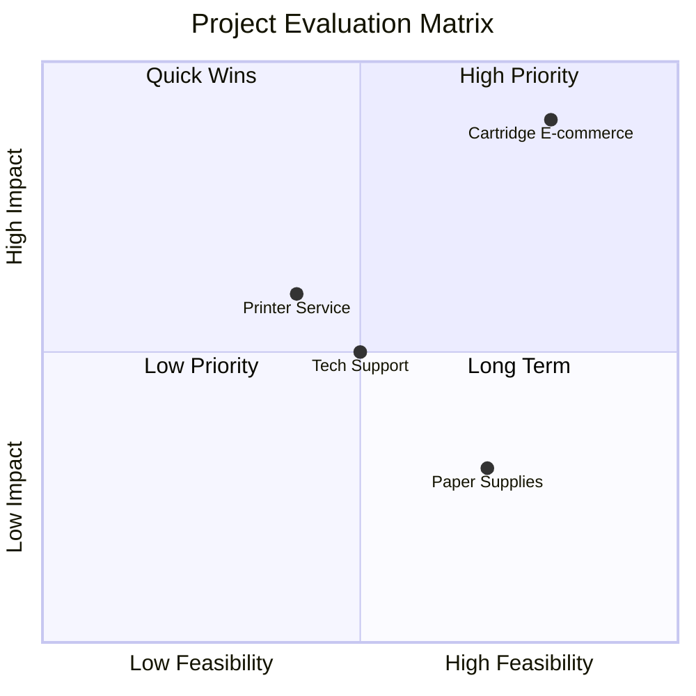

### Risk Assessment
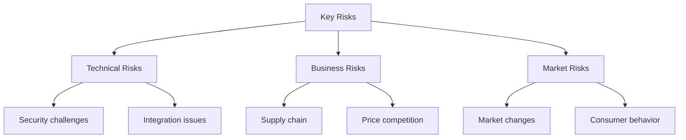

## 4. Decision and Refinement

### Selected MVP: ForMyPrinter (FMP)
Core Problem Solving:
- Simplifying printer cartridge selection
- Reducing environmental impact
- Optimizing cost for customers

### Feature Prioritization
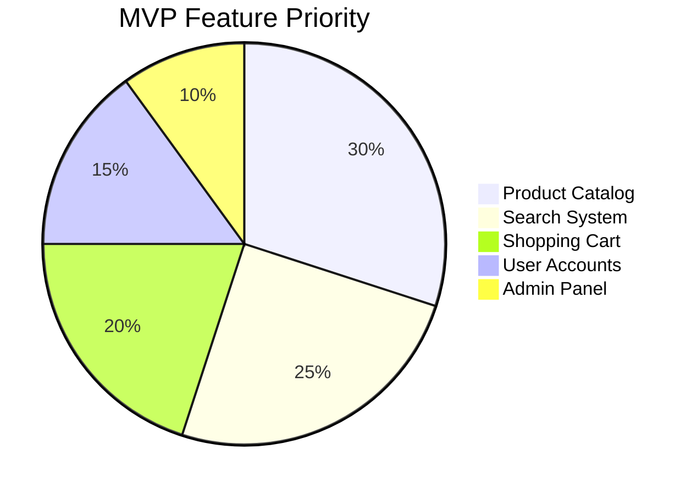

### Technical Architecture
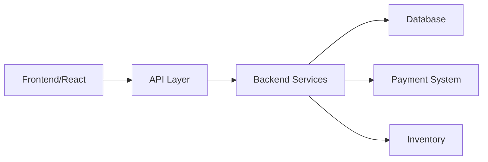

## 5. Implementation Planning

### Development Timeline
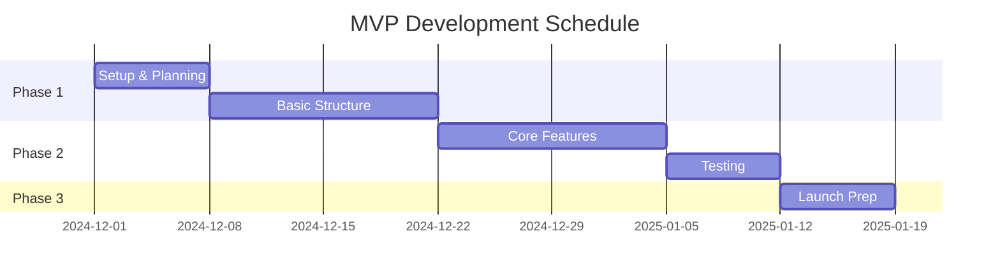

[Image Prompt: Create a mockup of the main product page showing the cartridge selection interface with eco-friendly elements]

## 6. Expected Outcomes

### Business Goals
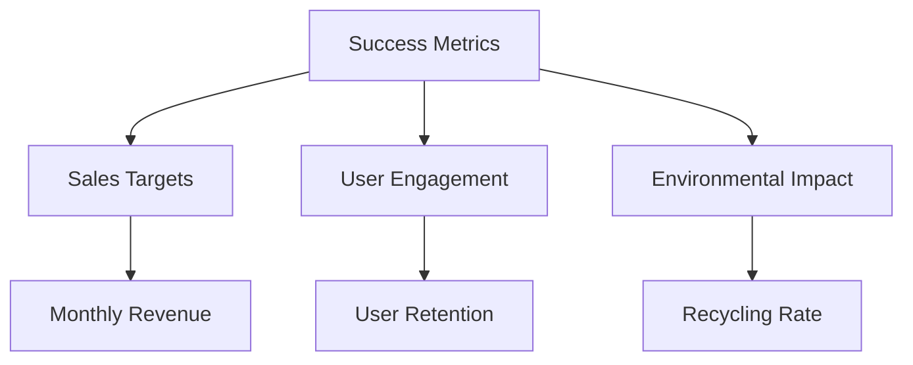

### Target Market Segmentation
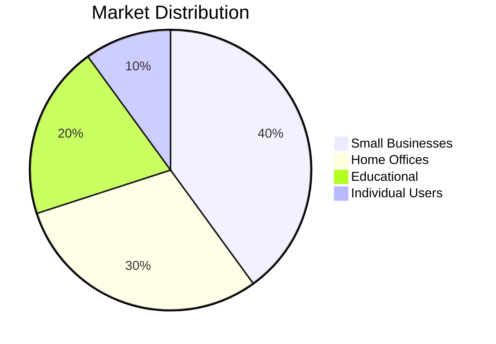
