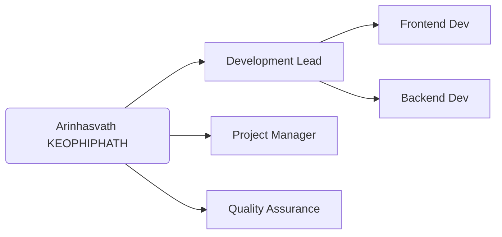
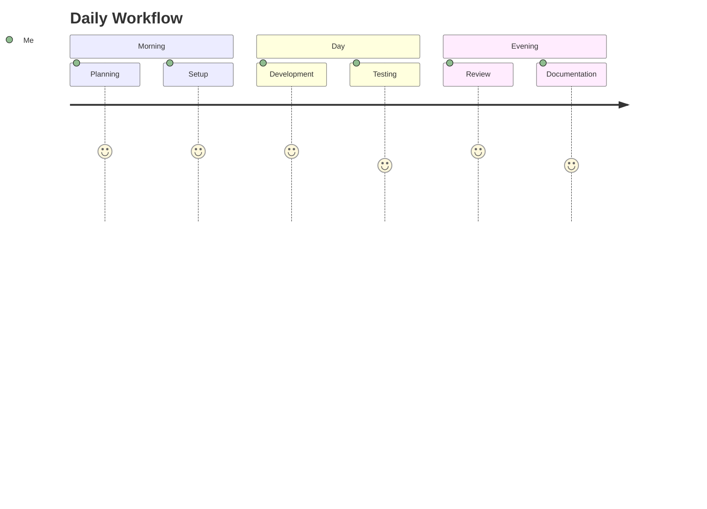
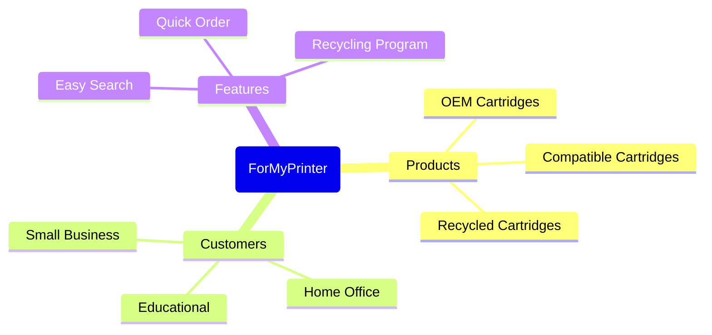
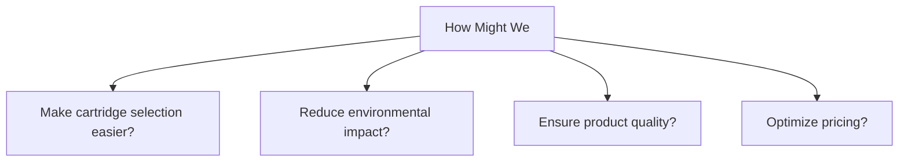
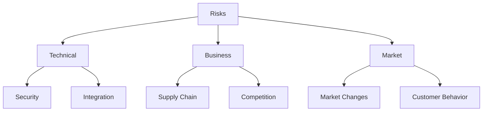
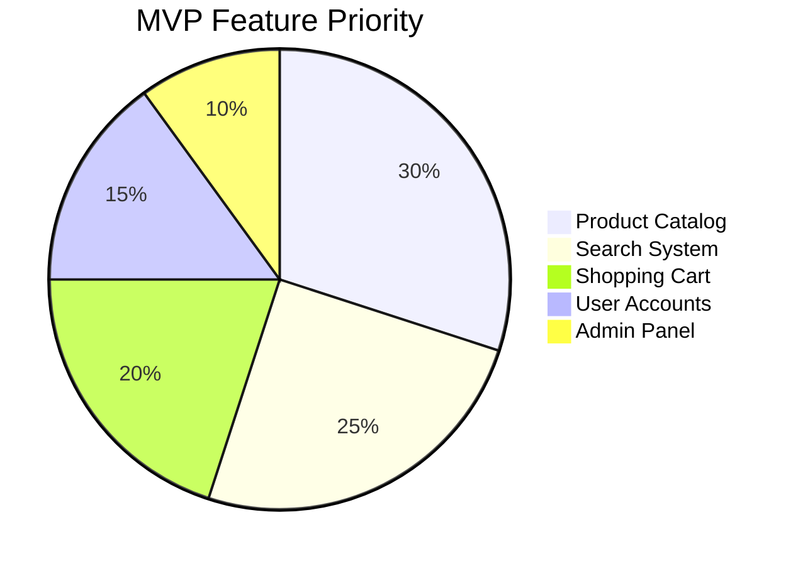
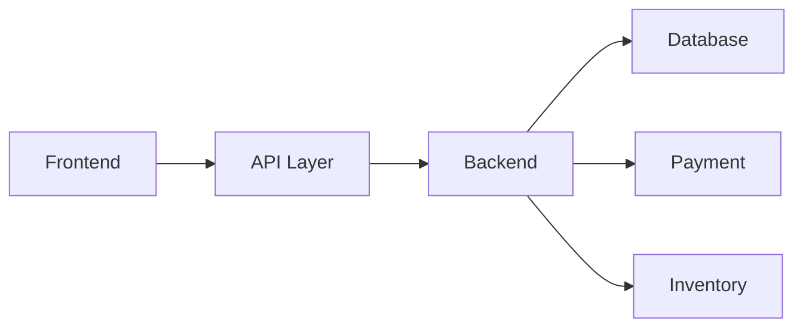
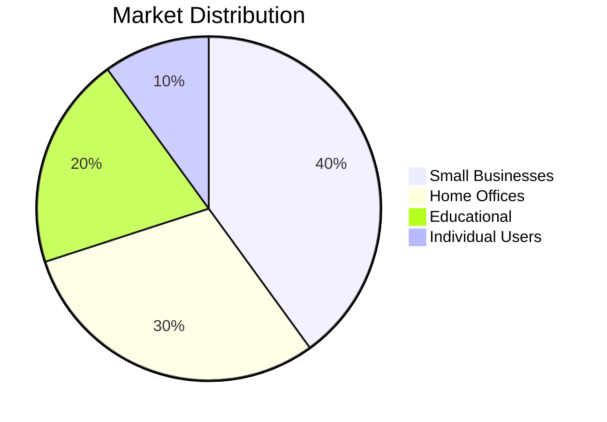
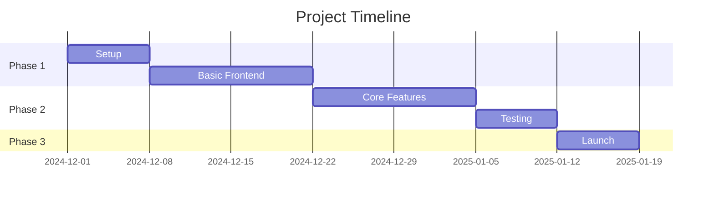

# ForMyPrinter (FMP) Portfolio Project
By Arinhasvath KEOPHIPHATH

## EXERCISE 0: TEAM FORMATION

### Roles and Responsibilities Overview

### Development Tools and Environment

| Area | Tools |
|------|-------|
| Development | VS Code, GitHub |
| Project Management | Trello |
| Documentation | Google Workspace |
| Communication | Discord |

### Daily Schedule

## EXERCISE 1: RESEARCH AND BRAINSTORMING

### Market Research Mind Map

### SCAMPER Analysis

| Category | Application |
|----------|-------------|
| Substitute | Replace physical store with e-commerce |
| Combine | Merge ordering with recycling program |
| Adapt | Customize for different printer brands |
| Modify | Enhance search and ordering process |
| Put to other use | Convert used cartridges into recycled ones |
| Eliminate | Remove complex ordering steps |
| Reverse | Implement subscription-first approach |

### "How Might We" Questions

## EXERCISE 2: IDEA EVALUATION

### Evaluation Matrix

| Criteria | Score (1-5) | Notes |
|----------|-------------|-------|
| Technical Feasibility | 4 | Standard e-commerce stack |
| Market Potential | 5 | Growing eco-friendly market |
| Innovation | 4 | Recycling program integration |
| Resource Requirements | 4 | Solo development manageable |
| Scalability | 5 | Easy to expand product range |

### Risk Assessment

## EXERCISE 3: DECISION AND REFINEMENT

### Selected MVP Features

### Technical Architecture

## EXERCISE 4: IDEA DEVELOPMENT DOCUMENTATION

### Project Overview

ForMyPrinter (FMP) is an e-commerce platform specializing in printer cartridges, offering three main product lines:
- OEM cartridges
- Compatible cartridges
- Recycled cartridges

### Target Market Segments

### Development Timeline

### Contact Information
- **Name:** Arinhasvath KEOPHIPHATH
- **Project:** ForMyPrinter (FMP)
- **Role:** Full-Stack Developer & Project Manager
